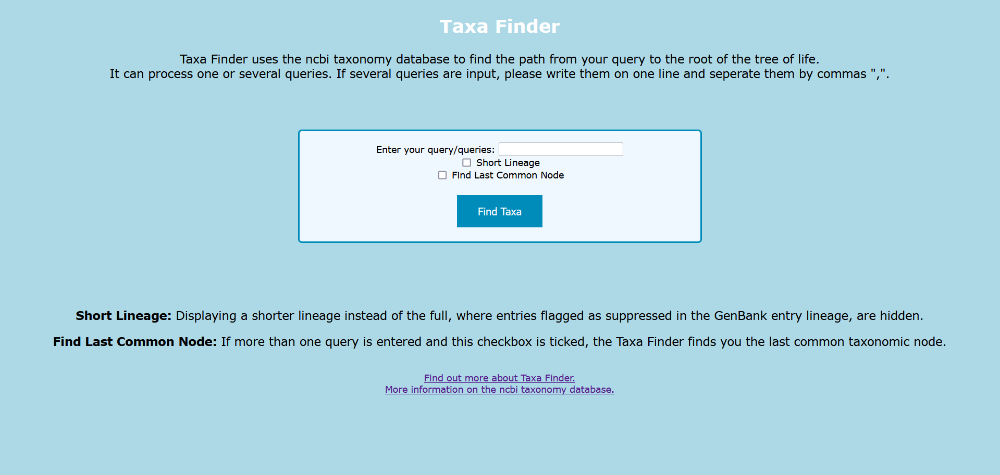
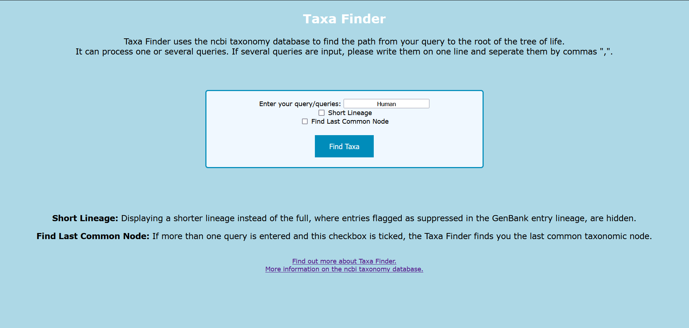
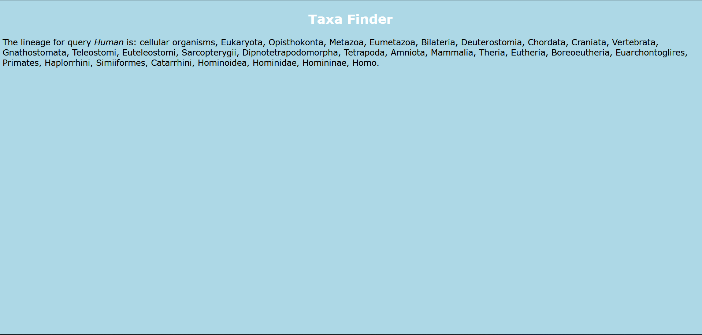
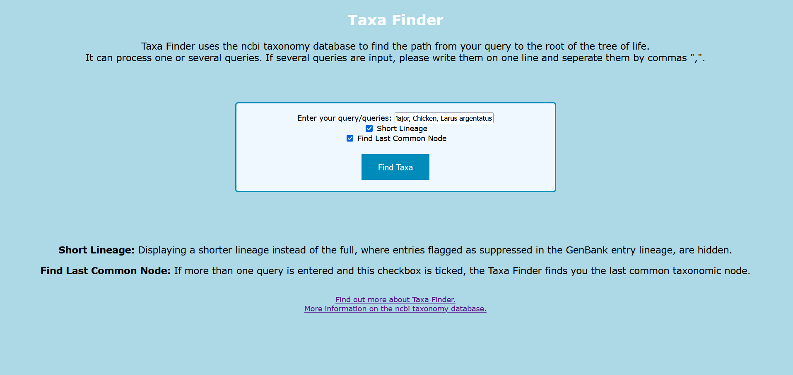
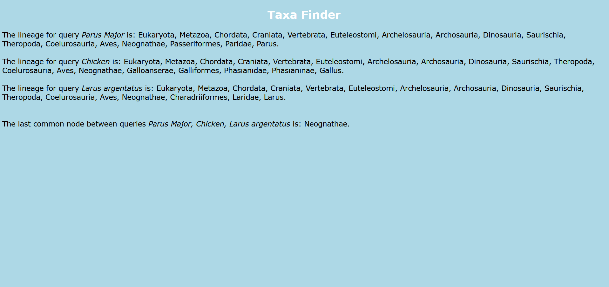

# Taxa Finder

## Necessary Files

<p>Two files are necessary to run Taxa_Finder.py: nodes.dmp and names.dmp. They are part of a collection of files, taxdump, uploaded by ncbi as a part of their taxonomy database.
They can be found in taxdump.tar.gz (or any other zipped format of taxdump) at:<p>

https://ftp.ncbi.nlm.nih.gov/pub/taxonomy/

or downloaded directly over the console with:

wget https://ftp.ncbi.nlm.nih.gov/pub/taxonomy/taxdump.tar.gz 

Make sure to unzip the files regardless of how you download them, and then save them in the same directory as Taxa_finder.py and Taxa_finder_web.py. Note that the files get updated regularly, the ones the examples were made with are from 07.03.22.


## Commands

<p> The script will take a query (or several) and return the lineage from the root of the taxonomic tree to the query (in case of several, for each query). It can be run as part of a pipeline, as one can run it with input and output file. Note that when both input file and string queries are given, only one set of queries will be accepted.
  
### Run in command line:
  
```
usage: Taxa_Finder -i INPUT [-s] [-p] -[o] [OUTPUT]
Returns lineage of query based on ncbi`s taxonomy database.

optional arguments:
  -h, --help                                              show this help message and exit
  --input INPUT [INPUT ...], -i INPUT [INPUT ...]         Query name, either single string, or several strings seperated by space.
  --infile INPUTFILE, -f INPUTFILE                        csv file containing queries.
  --out [OUT], -o [OUT]                                   Lineage printed in specified output file. Default: Lineage.txt
  --short, -s                                             The lineage returned will only include entries not flagged as hidden by ncbi.
  --print, -p                                             The lineage is printed to console.
  --common, -c                                            Additionally returns the last common taxonomic node of the queries lineage. 
```

### Run in web interface:
Uses Flask (Python v3.6.15, Flask v2.0.3, Werkzeug v2.0.2) to display a webinterface for Taxa Finder.
Seeing the webinterface requires the user to install Flask on their local machine, and run it in the same directory as the Taxa_Finder_web.py file, the templates folder, names.dmp and nodes.dmp are located. Note that if Flask is used over conda, it needs to be activated first. Then the webinterface can be started with:

```shell
python Tax_v04_web.py
```
The webinterface can process one or more queries, and gives the user the option, whether they want a shortened lineage and/or find the last common node (when having several queries). The results are output on the webpage, there is no output file option on the webinterface.




## Example of useage
  
### Console
<p>Queries can be formal and informal names, though not all entries have their informal names registered, so to be on the safe side it is recommended to use the formal name of the query.</p>

<p> One Query, result printed to screen: </p>  

```shell
python Taxa_Finder.py -i Human -p                                
Lineage for query Human: cellular organisms, Eukaryota, Opisthokonta, Metazoa, Eumetazoa, Bilateria, Deuterostomia, Chordata, Craniata, Vertebrata, Gnathostomata, Teleostomi, Euteleostomi, Sarcopterygii, Dipnotetrapodomorpha, Tetrapoda, Amniota, Mammalia, Theria, Eutheria, Boreoeutheria, Euarchontoglires, Primates, Haplorrhini, Simiiformes, Catarrhini, Hominoidea, Hominidae, Homininae, Homo.   
```

<p> Two queries, result, including last common node and abbreviated lineage, printed to screen and output file (chosen as Cat_Human_Lineage.txt).

```shell
python Taxa_Finder.py -i "Homo Sapiens" "Cat" -o "Cat_Human_Lineage.txt" -p -s -c                                                                                                        
Lineage for query Homo Sapiens: Eukaryota, Metazoa, Chordata, Craniata, Vertebrata, Euteleostomi, Mammalia, Eutheria, Euarchontoglires, Primates, Haplorrhini, Catarrhini, Hominidae, Homo.                                                                                                                                                                             
Lineage for query Cat: Eukaryota, Metazoa, Chordata, Craniata, Vertebrata, Euteleostomi, Mammalia, Eutheria, Laurasiatheria, Carnivora, Feliformia, Felidae, Felinae, Felis.                                                                                                                                                                                            
Last common node between queries: Eutheria
```
Output file is saved in same directory as script is run. 
  
### Webinterface

 

  

  

